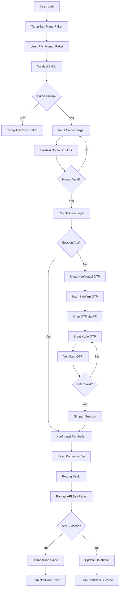

# 🔄 fadzDor Bot - API Flow & System Documentation

Dokumentasi lengkap alur sistem dan integrasi API untuk fadzDor Bot.

## 🏗️ Arsitektur Sistem

```
┌─────────────────┐    ┌─────────────────┐    ┌─────────────────┐
│   WhatsApp      │────│   fadzDor Bot   │────│   Hesda Store   │
│     User        │    │     System      │    │      API        │
└─────────────────┘    └─────────────────┘    └─────────────────┘
                               │
                       ┌───────┴───────┐
                       │               │
                   ┌───▼────┐    ┌─────▼─────┐
                   │  JSON  │    │  Winston  │
                   │Database│    │  Logging  │
                   └────────┘    └───────────┘
```

## 📋 Database Schema

### users.json
```json
{
  "628123456789": {
    "phoneNumber": "628123456789",
    "saldo": 50000,
    "totalTransaksi": 5,
    "registeredAt": "2025-01-15T10:30:00.000Z",
    "lastActivity": "2025-01-20T15:45:00.000Z",
    "sessions": {}
  }
}
```

### transactions.json
```json
{
  "TRX-1705745400000-abc123": {
    "trxId": "TRX-1705745400000-abc123",
    "phoneNumber": "628123456789",
    "targetNumber": "628123456789", 
    "packageName": "Paket Vidio Unlimited",
    "packageId": "ZVdMVXcyKzdJRlJERVdJc1hpVUhmQQ",
    "amount": 4500,
    "cost": 1500,
    "status": "SUCCESS",
    "hesdaTrxId": "66ecfd67-ec36-4d09-8b0f-8bf0dd7496d7",
    "paymentMethod": "DANA",
    "createdAt": "2025-01-20T10:30:00.000Z",
    "updatedAt": "2025-01-20T10:31:00.000Z"
  }
}
```

### sessions.json
```json
{
  "628123456789": {
    "accessToken": "814991:8b284b50-3905-463d-837a-d5e4cbe4c6b1",
    "authId": "28b028f7-69bd-417e-8510-691d23df7d25",
    "createdAt": "2025-01-20T10:30:00.000Z",
    "lastUsed": "2025-01-20T15:45:00.000Z"
  }
}
```

## 🔄 Alur Pembelian Paket (Detailed Flow)

### 1. User Flow - Pembelian Paket



### 2. API Integration Flow

#### A. Session Management
```javascript
// 1. Cek Session Existing
GET /v2/cek_sesi_login?hesdastore=KEY&no_hp=628123456789

// Response Success:
{
  "status": true,
  "message": "Berhasil Login!",
  "data": {
    "access_token": "722081:c31ae2c0-d090-44b6-b497-1f310c34asj"
  }
}

// Response Failed:
{
  "status": false,
  "message": "Nomor tidak ditemukan!",
  "data": []
}
```

#### B. OTP Flow (jika session tidak ada)
```javascript
// 1. Request OTP
POST /v2/get_otp
FormData: {
  hesdastore: KEY,
  no_hp: "628123456789",
  metode: "OTP"
}

// Response Success:
{
  "statusCode": 200,
  "status": true,
  "message": "Berhasil mengirim kode OTP...",
  "data": {
    "auth_id": "28b028f7-69bd-417e-8510-691d23df7d25",
    "can_resend_in": 60
  }
}

// 2. Verify OTP
POST /v2/login_sms
FormData: {
  hesdastore: KEY,
  no_hp: "628123456789", 
  metode: "OTP",
  auth_id: "28b028f7-69bd-417e-8510-691d23df7d25",
  kode_otp: "617884"
}

// Response Success:
{
  "statusCode": 200,
  "status": true,
  "message": "Berhasil Login OTP!",
  "data": {
    "access_token": "814991:8b284b50-3905-463d-837a-d5e4cbe4c6b1"
  }
}
```

#### C. Package Purchase
```javascript
// 1. Buy Package
POST /v2/beli/otp
FormData: {
  hesdastore: KEY,
  package_id: "ZVdMVXcyKzdJRlJERVdJc1hpVUhmQQ",
  access_token: "814991:8b284b50-3905-463d-837a-d5e4cbe4c6b1",
  uri: "package_purchase_otp",
  no_hp: "628123456789"
}

// Response Success (DANA):
{
  "statusCode": 200,
  "status": true,
  "message": "Pastikan kamu punya aplikasi DANA...",
  "data": {
    "msisdn": "628123456789",
    "package_id": "ZVdMVXcyKzdJRlJERVdJc1hpVUhmQQ",
    "nama_paket": "Xtra Unlimited Turbo Vidio...",
    "trx_id": "66ecfd67-ec36-4d09-8b0f-8bf0dd7496d7",
    "status": "SUCCESS",
    "have_deeplink": true,
    "deeplink_data": {
      "payment_method": "DANA",
      "deeplink_url": "https://m.dana.id/link/pay?..."
    }
  }
}

// Response Success (QRIS):
{
  "statusCode": 200,
  "status": true,
  "message": "Silakan scan/upload QR...",
  "data": {
    "msisdn": "628123456789",
    "package_id": "ZVdMVXcyKzdJRlJERVdJc1hpVUhmQQ",
    "nama_paket": "Xtra Unlimited Turbo Vidio...",
    "trx_id": "b479a884-c860-4597-ad98-a575f730be1b",
    "status": "SUCCESS",
    "have_deeplink": false,
    "deeplink_data": {
      "payment_method": "QRIS",
      "deeplink_url": ""
    },
    "is_qris": true,
    "qris_data": {
      "qr_code": "00020101021226570011ID.DANA.WWW...",
      "payment_expired_at": 1748400363,
      "remaining_time": 299
    }
  }
}
```

#### D. Transaction Status Check
```javascript
// Check Transaction Status
GET /v2/cekStatus?hesdastore=KEY&trx_id=66ecfd67-ec36-4d09-8b0f-8bf0dd7496d7

// Response Success:
{
  "status": true,
  "message": "Transaksi ditemukan",
  "data": {
    "package_id": "ZVdMVXcyKzdJRlJERVdJc1hpVUhmQQ",
    "package_name": "Xtra Unlimited Turbo Vidio...",
    "trx_id": "66ecfd67-ec36-4d09-8b0f-8bf0dd7496d7",
    "no_hp": "628123456789",
    "status": "SUCCESS" // or "PENDING" or "FAILED"
  }
}
```

## 🛡️ Error Handling & Recovery

### 1. Saldo Protection Flow
```javascript
// Step 1: Cek saldo sebelum transaksi
if (user.saldo < packagePrice) {
  return sendMessage(sock, sender, 'Saldo tidak mencukupi');
}

// Step 2: Potong saldo (temporary hold)
await db.updateUserSaldo(sender, packagePrice, 'subtract');

// Step 3: Simpan transaksi dengan status PROCESSING
const transaction = await db.saveTransaction({
  status: 'PROCESSING',
  phoneNumber: sender,
  amount: packagePrice
});

try {
  // Step 4: Panggil API
  const result = await hesdaApi.buyPackage(targetNumber, packageId, accessToken);
  
  if (result.success) {
    // Step 5a: Success - Update status
    await db.updateTransactionStatus(transaction.trxId, 'SUCCESS');
    logTransaction('PURCHASE_SUCCESS', sender, packagePrice, 'SUCCESS');
  } else {
    // Step 5b: API Failed - Rollback saldo
    await db.updateUserSaldo(sender, packagePrice, 'add');
    await db.updateTransactionStatus(transaction.trxId, 'FAILED');
    logTransaction('PURCHASE_FAILED', sender, packagePrice, 'FAILED');
  }
} catch (error) {
  // Step 5c: System Error - Rollback saldo
  await db.updateUserSaldo(sender, packagePrice, 'add');
  await db.updateTransactionStatus(transaction.trxId, 'ERROR');
  logTransaction('PURCHASE_ERROR', sender, packagePrice, 'ERROR');
}
```

### 2. Session Recovery
```javascript
async function getAccessToken(phoneNumber) {
  // 1. Cek session database local
  const localSession = await db.getSession(phoneNumber);
  if (localSession) {
    // Test session masih valid
    const testResult = await hesdaApi.checkPackageDetail(phoneNumber, localSession.accessToken);
    if (testResult.success) {
      await db.updateSessionLastUsed(phoneNumber);
      return { success: true, accessToken: localSession.accessToken };
    }
  }

  // 2. Cek session di API Hesda
  const apiSession = await hesdaApi.checkLoginSession(phoneNumber);
  if (apiSession.success) {
    // Update local database
    await db.saveSession(phoneNumber, apiSession.accessToken);
    return apiSession;
  }

  // 3. Perlu OTP baru
  return {
    success: false,
    needOtp: true,
    message: 'Perlu verifikasi OTP untuk melanjutkan'
  };
}
```

## 📊 Logging System

### 1. Log Categories
- **bot.log**: Aktivitas umum bot
- **api.log**: Panggilan API Hesda
- **transaction.log**: Transaksi pembelian
- **user.log**: Aktivitas user
- **admin.log**: Aktivitas admin
- **system.log**: Error sistem

### 2. Log Format
```javascript
// Winston Log Structure
{
  "timestamp": "2025-01-20 15:30:45",
  "level": "info",
  "message": "PURCHASE_SUCCESS - User: 628123456789 - Amount: 4500 - Status: SUCCESS",
  "service": "fadzDor-bot",
  "category": "transaction",
  "trxId": "TRX-1705745400000-abc123",
  "details": "Package: Paket Vidio Unlimited"
}
```

### 3. Log Analysis Queries
```bash
# Transaksi hari ini
grep "$(date +%Y-%m-%d)" logs/transaction.log | grep "PURCHASE_SUCCESS" | wc -l

# Error rate
grep "ERROR" logs/transaction.log | wc -l

# Revenue hari ini
grep "$(date +%Y-%m-%d)" logs/transaction.log | grep "PURCHASE_SUCCESS" | grep -o 'Amount: [0-9]*' | awk '{sum += $2} END {print sum}'

# User paling aktif
grep "COMMAND_RECEIVED" logs/bot.log | grep -o 'User: [0-9]*' | sort | uniq -c | sort -nr | head -10
```

## 🔧 Configuration Management

### 1. Package Configuration
```javascript
// config/config.js - Package Structure
packages: {
  package_key: {
    package_id: 'HESDA_PACKAGE_ID',      // ID dari Hesda Store
    name: 'Display Name',                 // Nama yang ditampilkan ke user
    price: 4500,                         // Harga jual ke user (Rupiah)
    cost: 1500,                          // Harga beli dari provider (Rupiah)
    description: 'Package description',   // Deskripsi untuk user
    payment_method: ['DANA', 'QRIS'],    // Method pembayaran yang didukung
    active: true,                        // Status aktif/nonaktif
    category: 'unlimited'                // Kategori paket
  }
}
```

### 2. Dynamic Package Management (Admin)
```javascript
// Tambah paket baru (via admin command)
async function addPackage(packageData) {
  const packages = await db.getPackages();
  packages[packageData.code] = {
    ...packageData,
    active: true,
    createdAt: new Date().toISOString(),
    updatedAt: new Date().toISOString()
  };
  await db.savePackage(packages[packageData.code]);
  
  // Update config runtime
  config.packages[packageData.code] = packages[packageData.code];
}

// Edit paket (via admin command) 
async function editPackage(packageCode, updates) {
  const packages = await db.getPackages();
  if (packages[packageCode]) {
    packages[packageCode] = {
      ...packages[packageCode],
      ...updates,
      updatedAt: new Date().toISOString()
    };
    await db.savePackage(packages[packageCode]);
    
    // Update config runtime
    config.packages[packageCode] = packages[packageCode];
  }
}
```

## 🚨 Monitoring & Alerts

### 1. System Health Metrics
```javascript
// Health Check Points
const healthChecks = {
  apiConnectivity: async () => {
    const result = await hesdaApi.checkBalance('health-check');
    return result.success;
  },
  
  databaseIntegrity: async () => {
    try {
      const users = await db.getAllUsers();
      const transactions = await db.readFile('./data/transactions.json');
      return Object.keys(users).length >= 0 && Object.keys(transactions).length >= 0;
    } catch {
      return false;
    }
  },
  
  memoryUsage: () => {
    const memUsage = process.memoryUsage();
    const heapUsedMB = memUsage.heapUsed / 1024 / 1024;
    return heapUsedMB < 500; // Alert if > 500MB
  },
  
  diskSpace: () => {
    // Check log file sizes
    const fs = require('fs');
    const logDir = './logs';
    if (!fs.existsSync(logDir)) return true;
    
    const files = fs.readdirSync(logDir);
    const totalSize = files.reduce((sum, file) => {
      const stats = fs.statSync(`${logDir}/${file}`);
      return sum + stats.size;
    }, 0);
    
    return totalSize < 100 * 1024 * 1024; // Alert if logs > 100MB
  }
};
```

### 2. Real-time Alerts
```javascript
// Alert Triggers
const alerts = {
  highFailureRate: (successRate) => {
    if (successRate < 90) {
      logSystemError(new Error(`High failure rate: ${successRate}%`), 'ALERT');
      // Send notification to admin
      notifyAdmin(`🚨 Alert: Transaction success rate dropped to ${successRate}%`);
    }
  },
  
  lowBalance: (balance) => {
    if (balance < 100000) { // Alert if system balance < 100k
      logSystemError(new Error(`Low system balance: ${balance}`), 'ALERT');
      notifyAdmin(`⚠️ Alert: System balance low: Rp.${balance.toLocaleString('id-ID')}`);
    }
  },
  
  highErrorRate: (errorCount, timeWindow) => {
    if (errorCount > 10) { // More than 10 errors in timeWindow
      logSystemError(new Error(`High error rate: ${errorCount} errors`), 'ALERT');
      notifyAdmin(`🚨 Alert: ${errorCount} errors in last ${timeWindow} minutes`);
    }
  }
};
```

## 🔄 Backup & Recovery

### 1. Automated Backup Strategy
```bash
#!/bin/bash
# scripts/backup.sh

DATE=$(date +%Y%m%d_%H%M%S)
BACKUP_DIR="backup/backup_$DATE"

# Create backup directory
mkdir -p $BACKUP_DIR

# Backup data files
cp -r data/ $BACKUP_DIR/
cp .env $BACKUP_DIR/env.backup
cp -r baileys_auth/ $BACKUP_DIR/ 2>/dev/null || true

# Backup logs (last 7 days only)
find logs/ -name "*.log" -mtime -7 -exec cp {} $BACKUP_DIR/ \;

# Compress backup
tar -czf "backup_$DATE.tar.gz" -C backup backup_$DATE/
rm -rf $BACKUP_DIR

# Keep only last 30 backups
ls -t backup_*.tar.gz | tail -n +31 | xargs rm -f

echo "Backup completed: backup_$DATE.tar.gz"
```

### 2. Recovery Procedures
```bash
# Recovery dari backup
#!/bin/bash
# scripts/restore.sh

BACKUP_FILE=$1

if [ -z "$BACKUP_FILE" ]; then
    echo "Usage: ./restore.sh backup_20250120_143000.tar.gz"
    exit 1
fi

# Stop bot
pm2 stop fadzDor-bot 2>/dev/null || true

# Backup current state
mv data/ data_backup_$(date +%Y%m%d_%H%M%S)

# Extract backup
tar -xzf $BACKUP_FILE
mv backup/backup_*/data/ ./
mv backup/backup_*/env.backup .env 2>/dev/null || true
mv backup/backup_*/baileys_auth/ ./ 2>/dev/null || true

# Cleanup
rm -rf backup/backup_*/

# Restart bot
npm start

echo "Recovery completed from $BACKUP_FILE"
```

## 📈 Performance Optimization

### 1. Database Optimization
```javascript
// Periodic cleanup untuk menghindari file JSON terlalu besar
async function cleanupOldData() {
  // Hapus session yang tidak digunakan > 30 hari
  const sessions = await db.readFile('./data/sessions.json');
  const cutoffDate = new Date(Date.now() - 30 * 24 * 60 * 60 * 1000);
  
  for (const [phone, session] of Object.entries(sessions)) {
    const lastUsed = new Date(session.lastUsed);
    if (lastUsed < cutoffDate) {
      delete sessions[phone];
    }
  }
  
  await db.writeFile('./data/sessions.json', sessions);
  
  // Archive transaksi lama (> 90 hari) ke file terpisah
  const transactions = await db.readFile('./data/transactions.json');
  const archiveDate = new Date(Date.now() - 90 * 24 * 60 * 60 * 1000);
  const activeTransactions = {};
  const archivedTransactions = {};
  
  for (const [trxId, tx] of Object.entries(transactions)) {
    const txDate = new Date(tx.createdAt);
    if (txDate > archiveDate) {
      activeTransactions[trxId] = tx;
    } else {
      archivedTransactions[trxId] = tx;
    }
  }
  
  await db.writeFile('./data/transactions.json', activeTransactions);
  await db.writeFile(`./backup/transactions_archive_${Date.now()}.json`, archivedTransactions);
}

// Jalankan cleanup setiap minggu
setInterval(cleanupOldData, 7 * 24 * 60 * 60 * 1000);
```

### 2. Memory Management
```javascript
// Monitor dan optimasi memory usage
function optimizeMemory() {
  // Clear expired user states
  const now = Date.now();
  for (const [user, state] of commandHandler.userStates.entries()) {
    if (state.timestamp && (now - state.timestamp) > 300000) { // 5 menit
      commandHandler.userStates.delete(user);
    }
  }
  
  // Force garbage collection jika tersedia
  if (global.gc) {
    global.gc();
  }
}

// Jalankan optimasi setiap 5 menit
setInterval(optimizeMemory, 5 * 60 * 1000);
```

## 🔒 Security Considerations

### 1. Input Validation
```javascript
// Validasi nomor HP
function validatePhoneNumber(phone) {
  const cleaned = phone.replace(/\D/g, '');
  
  // Cek format dasar
  if (!/^(62|0)/.test(cleaned)) return false;
  if (cleaned.length < 10 || cleaned.length > 15) return false;
  
  // Normalize ke format 62
  let normalized = cleaned;
  if (normalized.startsWith('0')) {
    normalized = '62' + normalized.substring(1);
  }
  
  // Validasi provider XL/Axis
  const validPrefixes = ['62817', '62818', '62819', '62877', '62878'];
  const isValid = validPrefixes.some(prefix => normalized.startsWith(prefix));
  
  return isValid ? normalized : false;
}

// Sanitasi input admin
function sanitizeAdminInput(input) {
  return input
    .replace(/[<>\"']/g, '') // Remove potential XSS chars
    .replace(/[;|&`]/g, '')  // Remove command injection chars
    .trim()
    .substring(0, 1000);     // Limit length
}
```

### 2. Rate Limiting
```javascript
// Rate limiting untuk mencegah spam
class RateLimiter {
  constructor() {
    this.requests = new Map();
    this.limits = {
      message: { count: 20, window: 60000 },      // 20 pesan per menit
      transaction: { count: 3, window: 300000 }, // 3 transaksi per 5 menit
      otp: { count: 3, window: 600000 }          // 3 OTP per 10 menit
    };
  }
  
  checkLimit(userId, type) {
    const limit = this.limits[type];
    if (!limit) return true;
    
    const userKey = `${userId}:${type}`;
    const now = Date.now();
    
    if (!this.requests.has(userKey)) {
      this.requests.set(userKey, []);
    }
    
    const requests = this.requests.get(userKey);
    
    // Remove expired requests
    const validRequests = requests.filter(time => (now - time) < limit.window);
    
    if (validRequests.length >= limit.count) {
      return false; // Rate limit exceeded
    }
    
    validRequests.push(now);
    this.requests.set(userKey, validRequests);
    return true;
  }
}

const rateLimiter = new RateLimiter();

// Usage dalam handler
if (!rateLimiter.checkLimit(sender, 'message')) {
  return await sendMessage(sock, sender, '⚠️ Terlalu banyak pesan. Tunggu sebentar.');
}
```

---

## 📞 API Reference Quick Guide

### Base URL
```
https://api.hesda-store.com/v2
```

### Authentication
```
Basic Auth: base64(username:password)
```

### Endpoints Summary
| Method | Endpoint | Purpose |
|--------|----------|---------|
| GET | `/saldo?hesdastore=KEY` | Cek saldo sistem |
| GET | `/cek_sesi_login?hesdastore=KEY&no_hp=PHONE` | Cek session login |
| GET | `/detail_paket?hesdastore=KEY&access_token=TOKEN` | Cek detail paket aktif |
| POST | `/get_otp` | Request kode OTP |
| POST | `/login_sms` | Verifikasi OTP |
| POST | `/beli/otp` | Beli paket |
| GET | `/cekStatus?hesdastore=KEY&trx_id=TRX_ID` | Cek status transaksi |

### Error Codes
- `200`: Success
- `400`: Bad Request (invalid parameters)  
- `401`: Unauthorized (invalid credentials)
- `500`: Internal Server Error

---

Dokumentasi ini mencakup semua aspek teknis sistem fadzDor Bot. Untuk implementasi dan troubleshooting lebih lanjut, refer ke file INSTALLATION.md dan README.md.